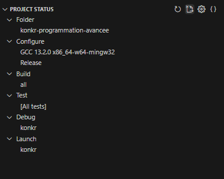
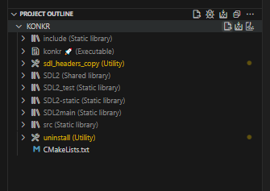

**Rkonk** est une recréation en C++ du jeu de stratégie Konkr, réalisée dans le cadre du cours de Programmation Avancée en master.


# Dépendances externes
- [GCC/G++ / MinGW 11.4.0](https://winlibs.com/) ([**Binaries Download**](https://github.com/brechtsanders/winlibs_mingw/releases/download/11.4.0-11.0.0-msvcrt-r1/winlibs-i686-posix-dwarf-gcc-11.4.0-mingw-w64msvcrt-11.0.0-r1.zip))
- [CMake 4.0.0-rc4 / 4.0.1](https://cmake.org/) ([**Windows x64 Installer**](https://github.com/Kitware/CMake/releases/download/v4.0.1/cmake-4.0.1-windows-x86_64.msi)) ([Docs](https://cmake.org/cmake/help/latest/))
- [SDL2](https://github.com/libsdl-org/SDL/tree/SDL2) ([Docs](https://wiki.libsdl.org/SDL2/FrontPage))
- [SDL_Image](https://github.com/libsdl-org/SDL_image) ([Docs](https://www.libsdl.org/projects/old/SDL_image/docs/index.html))

**_NB_**: exécuter la commande suivante pour garder les dépendances à jour :<br>
`git submodule update --init --recursive`

<br>

Pour générer la doc, supprimer le /docs existant puis :<br>
`doxygen Doxyfile`

L'index de la page web se situe à [<u>docs/html/index.html</u>](docs/html/index.html)

# Instructions de build

## Linux (machines de l'UFR)
A la racine du projet :

`mkdir build`<br>
`cmake -S ./ -B ./build/ -D CMAKE_BUILD_TYPE=Release`<br>
`cmake --build ./build/ --config Release -j8`<br>

IMPORTANT: Si ça compile pas, penser à supprimer CMakeCache.txt dans le dossier build!

## Windows 10 (64bit)
1) Télécharger les [binaires pour gcc+MinGW 11.4.0 (32bit)](https://github.com/brechtsanders/winlibs_mingw/releases/download/11.4.0-11.0.0-msvcrt-r1/winlibs-i686-posix-dwarf-gcc-11.4.0-mingw-w64msvcrt-11.0.0-r1.zip)
2) Extraire le fichier .zip puis le mettre dans un dossier (ex: C:/ ou /Downloads)
3) A la racine du répertoire Konkr :

`mkdir build`<br>
```
cmake -DCMAKE_CXX_COMPILER="C:\winlibs-i686-posix-dwarf-gcc-11.4.0-mingw-w64msvcrt-11.0.0-r1\mingw32\bin\g++.exe" -DCMAKE_C_COMPILER="C:\winlibs-i686-posix-dwarf-gcc-11.4.0-mingw-w64msvcrt-11.0.0-r1\mingw32\bin\gcc.exe" -S ./ -B ./build/ -D CMAKE_BUILD_TYPE=Release -G "MinGW Makefiles"
```
`cmake --build ./build/ --config Release -j8`


_NB_: Mettez le chemin complet vers g++.exe pour `DCMAKE_CXX_COMPILER` et gcc.exe pour `DCMAKE_C_COMPILER`.
Si l'option -G est `"Unix Makefiles"`, **la compilation ne fonctionnera pas** avec les chemins dont les dossiers possèdent des espaces.


## VSCode (obsolète)

**ATTENTION** : Cliquer sur le bouton "Delete Cache and Reconfigure" si tu veux reconfigurer le projet (très très important).<br>

Lorsqu'ya la config en arrière plan, faut être patient :)

Dans PROJECT STATUS :<br>


- "Select Kit" -> n'importe quel kit GCC
- "Select Variant" -> "Release"

Dans PROJECT OUTLINE :<br>


- Cliquer sur le bouton "Configure"
- Cliquer sur le bouton "Build" (_penser à "Clean" le projet "KONKR" de temps en temps en cas de modifs_).
<br><br>

# Pour lancer le jeu

`cd build/Release`<br>
`./konkr.exe` (ou ./konkr sous Linux)
